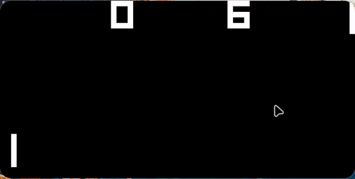
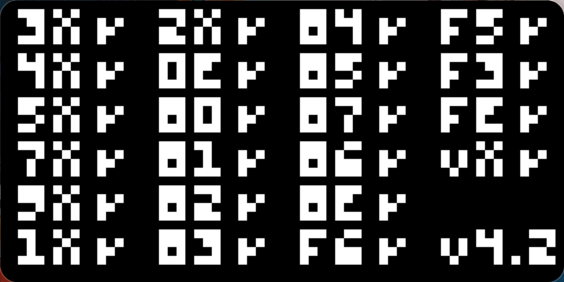

# CHIP-8 Emulator in Zig

This project is a CHIP-8 emulator written in Zig. The emulator simulates the functionality of the CHIP-8 virtual machine, allowing it to run CHIP-8 ROMs in a graphical interface that uses OpenGL.

# Demo

Pong gameplay



Corax+ test



## Project Structure

- **`main.zig`**: 
  - The entry point for the emulator. It initializes the window using GLFW bindings for Zig, from mach-glfw, loads a CHIP-8 ROM file, and sets up OpenGL shaders for rendering the graphics.
  
- **`stack.zig`**: 
  - Implements a simple stack data structure for use by the CHIP-8 virtual machine. The stack is essential for managing function calls and returning to the correct memory addresses.

- **`chip8.zig`**: 
  - This is the core of the CHIP-8 emulator. It handles opcode fetching and decoding, manages the internal state (memory, registers, stack, timers), and performs the required operations based on the current opcode.

- **`font.zig`**: 
  - Contains the default font that old interpreters had loaded in memory (commonly at address 0x050);

## Features Implemented

- **Memory Management**: 
  - The emulator manages a 4KB memory space and allows reading and writing from memory locations.
  
- **Stack Operations**: 
  - A custom stack is used to support function call and return instructions.
  
- **Opcode Decoding**: 
  - The emulator decodes and executes all CHIP-8 opcodes, including graphics-related ones for drawing sprites.

- **Timers**: 
  - The emulator handles the delay and sound timers, which are decremented at 60Hz.

- **Graphics and Input**: 
  - The emulator uses OpenGL to render the CHIP-8 display and GLFW to handle keyboard input.

## How It Works

1. **ROM Loading**: 
   - The `openROM` function loads a CHIP-8 ROM file into memory.
   
2. **CPU Execution**: 
   - The emulator fetches, decodes, and executes instructions in a loop, updating the display and handling input. This is handled by running multiple instructions (depending on speed) every tick (60hz), to achieve higher tick count, around the 600hz mark (can be modified depending on the game).
   
3. **Graphics Rendering**: 
   - The emulator uses OpenGL shaders to render the 64x32 monochrome display, scaling it up to fit the window size.

4. **Timers**:
   - Timers are decremented in sync with the main execution loop at 60hz;

## Future Improvements

- **Sound Implementation**
  
- **Configurable Keybindings**
  
- **Save States**

- **Support for Super CHIP-8**

---

## How to Run

1. Clone this repository along with subrepositories
2. Install Zig 0.13.0
3. Compile and run the emulator:
    ```bash
    zig build run -- PATH_TO_ROM
    ```

OpenGL version 4.5 (used https://github.com/ikskuh/zig-opengl), very likely could have used an older version for higher compatibility with older devices.

Glfw used with bindings from mach-glfw, slightly changed mach-glfw to allow versions other than the ones specified by mach.
