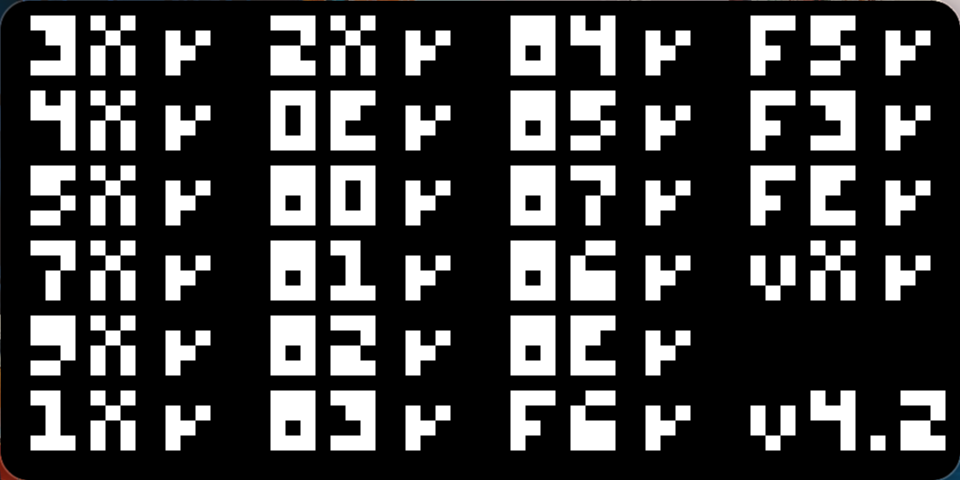

# CHIP-8 Emulator in Zig

This project is a CHIP-8 emulator written in Zig. The emulator simulates the functionality of the CHIP-8 virtual machine, allowing it to run CHIP-8 ROMs in a graphical interface that uses OpenGL.

# Demo

Pong gameplay


Corax+ test



## Future Improvements

- Sound Implementation
- Configurable Keybindings
- Save States
- Support for Super CHIP-8

## How to Run

1. Clone this repository along with subrepositories
2. Install Zig 0.13.0
3. Compile and run the emulator:
    ```bash
    zig build run -- PATH_TO_ROM
    ```

OpenGL version 4.5 (used https://github.com/ikskuh/zig-opengl), very likely could have used an older version for higher compatibility with older devices.

Glfw used with bindings from mach-glfw, slightly changed mach-glfw to allow versions other than the ones specified by mach.
